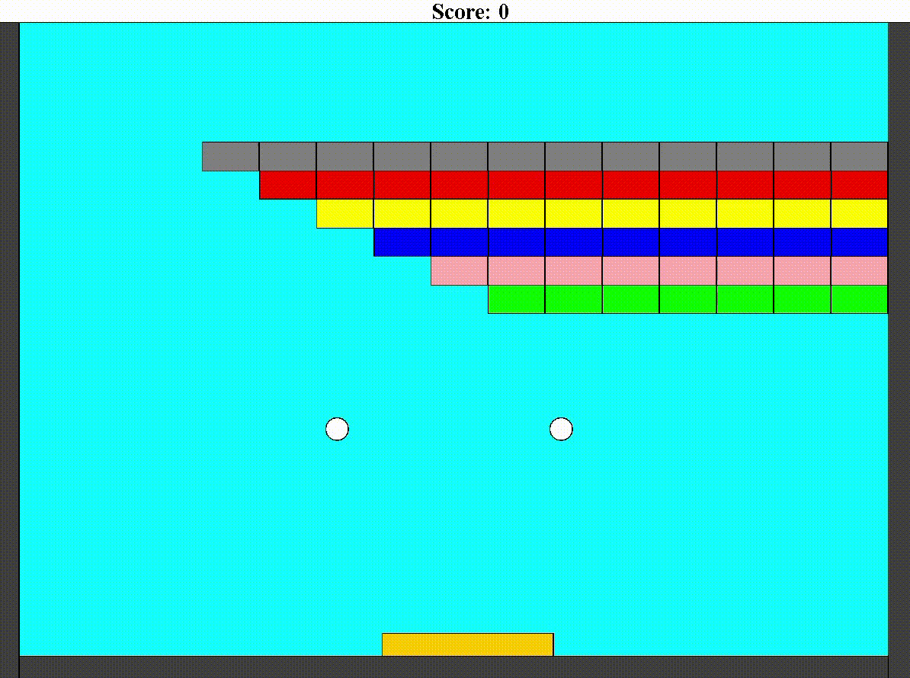

# Arkanoid Game

## Overview
This project is a classic Arkanoid Game implemented in Java.<br>
The objective is to destroy all the blocks by bouncing a ball off a paddle controlled by the player.<br>

## Features
- **Paddle Control**: Move the paddle left and right to bounce the ball.
- **Blocks**: Breakable blocks arranged in rows that the player must destroy.
- **Ball Physics**: The ball bounces off the walls, paddle, and blocks with realistic movement.
- **Collision Detection**: Collisions are accurately detected and handled to ensure smooth gameplay.
- **Game Over**: The game ends when the player destroys all the blocks or loses all the balls.
- **Score Tracking:** Keep track on the score on the top of the screen.
- **Dynamic Ball Color**: The ball color changes according to the last block you break. You can only break blocks that are a different color from the ball.

## How to Play
1. Run the program.
2. Control the paddle movement using the **left** (←) and **right** (→) arrow keys.
3. Try to break all the blocks by bouncing the balls off the paddle.
4. The ball color will change when you break a block, and you can only break blocks if their color is different from the ball's color.
5. Avoid dropping the balls below the paddle.
6. The game ends when the player destroys all the blocks or loses all the balls.

## Technologies Used
- **Language:** Java
- **Concepts:** Classes, Inheritance & Polymorphism, Observer, Collision Detection, Input Handling, Bouncing Mechanics, Sprite Animation & Management, Packages

## Setup and Usage
1. Clone the repository:
   ```bash
   git clone https://github.com/Fisher-Shira/Arkanoid-Game.git
2. Navigate to the project directory:
   ```bash
    cd Arkanoid-Game
3. Compile and run using make:
   ```bash
   make run
- If make is not installed, you can compile manually:
   ```bash
   javac -d build src/geometry_primitives/*.java src/sprite_settings/*.java src/*.java
   java -cp build ArkanoidGame
4. To clean the build directory:
   ```bash
   make clean

## Project Structure
- **`src/`**: Contains the Java source code for all game components, including the paddle, ball, blocks, and game logic.
- **`geometry_primitives/, sprite_settings/`**: Java packages inside src folder.
- **`assets/`**: Contains media files such as the demo GIF.
- **`Makefile`**: A file used to automate the build and setup process of the project (e.g., compilation and running the game).

## Demo Video
Watch a demo of the game:


